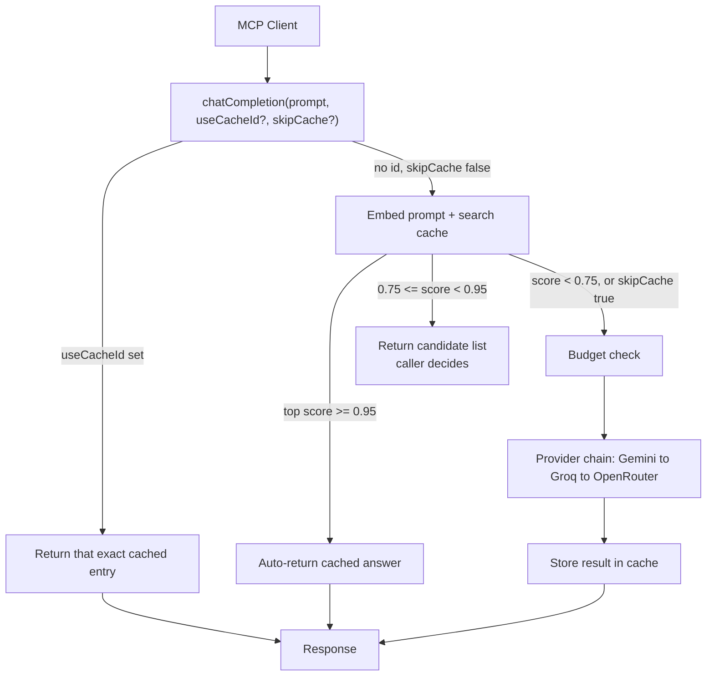

# CacheGate

A Java MCP server that sits between an MCP client (Claude Desktop, Claude Code) and multiple free-tier LLM providers — catching semantically duplicate prompts before they burn a request, asking for confirmation when a match is close-but-not-certain, and automatically falling back to another provider when one is rate-limited or down.

Built with Java 21, Spring Boot, and Spring AI's MCP support. A companion Streamlit console lets you exercise it without Claude Desktop open at all.

## Why

Free-tier LLM APIs are great until you hit their limits. This solves that (duplicate calls, rate limits, single-provider outages) while staying small enough to fully explain, end to end — not trying to out-build the enterprise gateways (Bifrost, Zuplo) that already solve this at a much bigger scale. It's also the infra every other free-tier-API project in my portfolio sits on top of.

## How it works



A near-perfect match (0.95+) returns instantly. A plausible-but-uncertain match (0.75–0.95) comes back as candidates instead of being trusted silently — pure similarity scores can't tell "genuine paraphrase" from "same sentence structure, different meaning" (a real case: "7 wonders of the ancient world" vs "...of the modern world" scored *higher*, 0.91, than an actual paraphrase at 0.84). Below auto-accept, a human makes the call instead of an algorithm guessing.

## Status

Feature-complete against the original scope — fallback chain, budget limiter, admin tools (`cacheStats`, `listProviders`, `clearCache`), SQLite persistence, and the Streamlit console are all built and tested, not aspirational.

**Known limitations:** the embedding step runs before the provider chain and has no fallback of its own — a Gemini embedding outage takes everything down even with two healthy chat providers configured. Running Claude Desktop and the Streamlit console simultaneously means two processes with independently-stale in-memory caches. Full detail in [TROUBLESHOOTING.md](./TROUBLESHOOTING.md).

## Getting started

**Prerequisites:** Java 21 (registered with `/usr/libexec/java_home`), Maven (`./mvnw` included), and three free API keys — [Gemini](https://aistudio.google.com/apikey), [Groq](https://console.groq.com), [OpenRouter](https://openrouter.ai) — none requiring a card.

```bash
git clone <your-repo-url>
cd cachegate
./mvnw clean package -DskipTests
```

**Configure Claude Desktop** — Settings → Developer → Edit Config:
```json
{
  "mcpServers": {
    "cachegate": {
      "command": "/path/to/your/java21/bin/java",
      "args": ["-jar", "/absolute/path/to/cachegate/target/cachegate-0.0.1-SNAPSHOT.jar"],
      "env": {
        "GEMINI_API_KEY": "your-gemini-key",
        "GROQ_API_KEY": "your-groq-key",
        "OPENROUTER_API_KEY": "your-openrouter-key"
      }
    }
  }
}
```
Use `/usr/libexec/java_home -v 21` for the exact path — GUI apps don't reliably see your shell's `PATH`. Fully quit and reopen Claude Desktop, then check "+" → Connectors for `cachegate`.

**Try it:** *"Use the cachegate chatCompletion tool to ask what the capital of France is."* Then ask a close paraphrase — you should get a candidate list, and Claude will ask whether to reuse it.

## Available tools

| Tool | What it does |
|---|---|
| `chatCompletion` | `prompt` (required), `useCacheId` (reuse a suggested candidate), `skipCache` (force a fresh call) |
| `cacheStats` | Cache size, hit rate, calls saved, budget usage |
| `listProviders` | Providers in fallback order, with last-known status this session |
| `clearCache` | Deletes all entries, resets stats |

## The Streamlit console

`streamlit_console/` talks to CacheGate directly over MCP — the only way to see it run without Claude Desktop. It keeps one persistent connection alive (a background thread running a permanent event loop) rather than spawning a fresh process per click, so only the first request pays JVM boot time.

Not deployed to Streamlit Community Cloud. It spawns a local Java process, and Community Cloud has no Java, no jar, and would need three free-tier keys exposed in a public app. A local demo (or a recorded GIF here) does the job without that risk.

```bash
cd streamlit_console
python3 -m venv venv && source venv/bin/activate
pip install -r requirements.txt
cp .env.example .env   # fill in real keys + the same Java/jar paths as above
streamlit run app.py
```

## Configuration

Full `application.yaml` and `.env` reference, plus every gotcha hit getting there, in [TROUBLESHOOTING.md](./TROUBLESHOOTING.md).

## Notable design decisions

- **Candidate confirmation, not a single similarity threshold** — a threshold can't separate genuine paraphrases from same-structure/different-meaning pairs, since they overlap in score range.

## License

MIT