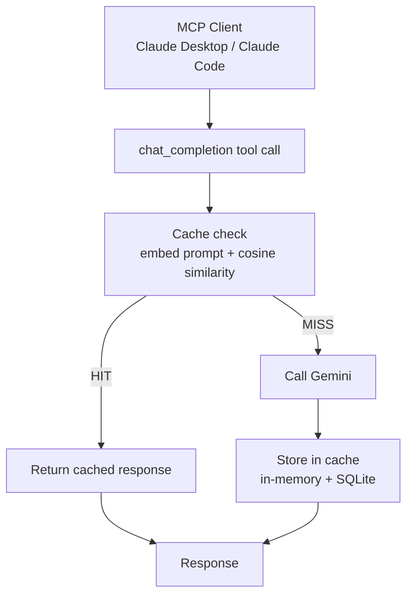

# CacheGate

A Java MCP server that sits between an MCP client (Claude Desktop, Claude Code) and a free-tier LLM provider — catching semantically duplicate prompts before they burn a request, so repeat-ish questions get served from cache instead of hitting the API again.

Built with Java 21, Spring Boot, and Spring AI's MCP support.

## Why this exists

Free-tier LLM APIs are great until you hit their limits — and you hit them fast when you're iterating. This project exists to solve a real problem (rate limits and duplicate calls eating a daily quota) while deliberately building something small enough to fully explain, end to end. 

Every project making free-tier LLM calls sits on top of this one instead of reimplementing caching from scratch each time.

## How it works



Every incoming prompt gets embedded and compared against everything already cached. If something close enough in *meaning* — not exact text — has been asked before, the cached answer comes back instantly and no LLM call happens. Otherwise it calls the provider, stores the result, and returns it.

## Status

**Working now:**
- ✅ MCP server over stdio, tested against Claude Desktop
- ✅ Real `chat_completion` tool backed by Gemini (`gemini-2.5-flash`)
- ✅ Semantic cache — embeds every prompt (`gemini-embedding-001`), cosine similarity match at a `0.80` threshold
- ✅ Cache persisted to SQLite — survives a full restart, not just in-memory
- ✅ Structured logging for every request: similarity score, hit/miss, whether the provider was actually called

**Not built yet (planned):**
- ⬜ Fallback across multiple providers (Groq, OpenRouter) when Gemini is rate-limited or down
- ⬜ Per-session request budget / rate limiting
- ⬜ `cache_stats` / `list_providers` tools
- ⬜ Streamlit test console for demoing without needing Claude Desktop open

## Getting started

**Prerequisites**
- Java 21 (a JDK installed via Homebrew or similar, registered with `/usr/libexec/java_home` — see [Troubleshooting](#troubleshooting) if `java -jar` complains about class file versions)
- Maven (or use the included `./mvnw`)
- A free Gemini API key from [aistudio.google.com/apikey](https://aistudio.google.com/apikey) — no credit card required

**Build**
```bash
git clone <your-repo-url>
cd cachegate
./mvnw clean package -DskipTests
```

**Configure Claude Desktop**

Open Claude Desktop → Settings → Developer → Edit Config, and add:
```json
{
  "mcpServers": {
    "cachegate": {
      "command": "/path/to/your/java21/bin/java",
      "args": ["-jar", "/absolute/path/to/cachegate/target/cachegate-0.0.1-SNAPSHOT.jar"],
      "env": {
        "GEMINI_API_KEY": "your-key-here"
      }
    }
  }
}
```
Use `/usr/libexec/java_home -v 21` in a terminal to find the exact Java path — don't rely on the bare word `java`, since GUI apps like Claude Desktop don't reliably see your shell's `PATH`.

Fully quit and reopen Claude Desktop, then check the "+" → Connectors panel for `cachegate`.

**Try it**

In a Claude Desktop chat:
> Use the cachegate chatCompletion tool to ask what the capital of France is.

Then ask a differently-worded version of the same question — the second one should come back near-instantly from cache.

## Configuration reference

`src/main/resources/application.yaml`:
```yaml
spring:
  main:
    banner-mode: "off"
  ai:
    mcp:
      server:
        stdio: true
        name: cachegate
        version: 0.1.0
    google:
      genai:
        api-key: ${GEMINI_API_KEY}
        chat:
          options:
            model: gemini-2.5-flash
        embedding:
          api-key: ${GEMINI_API_KEY}
          text:
            model: gemini-embedding-001
  datasource:
    url: jdbc:sqlite:/absolute/path/to/cachegate/cachegate.db
    driver-class-name: org.sqlite.JDBC
  sql:
    init:
      mode: always
```

Logging is configured separately in `src/main/resources/logback-spring.xml` — everything goes to `logs/cachegate.log`, nothing to stdout, since stdout is reserved for the MCP protocol itself.

## Troubleshooting

A few real issues hit while building this, kept here in case they save someone else the time they cost me.

**Google GenAI embedding calls fail with "project-id must be set", even though chat works fine with just an API key.** The embedding module has its own separate connection configuration from chat — it doesn't inherit the top-level `spring.ai.google.genai.api-key`. Set `spring.ai.google.genai.embedding.api-key` explicitly too.

**Inconsistent cache behavior — hits reported that don't show up in the database.** Almost always means more than one instance of the jar is running at once (usually a forgotten manual test process left running in another terminal tab). Check with `ps aux | grep cachegate` and kill anything you don't expect before restarting Claude Desktop.

## License

MIT