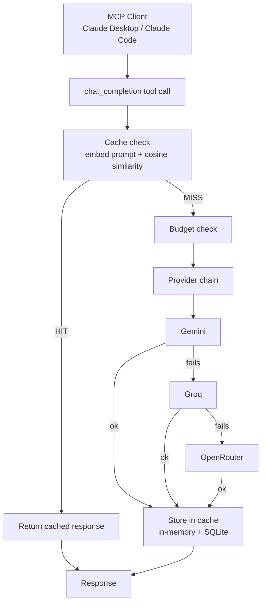

# CacheGate

A Java MCP server that sits between an MCP client (Claude Desktop, Claude Code) and multiple free-tier LLM providers — catching semantically duplicate prompts before they burn a request, and automatically falling back to another provider when one is rate-limited or down.

Built with Java 21, Spring Boot, and Spring AI's MCP support.

## Why this exists

Free-tier LLM APIs are great until you hit their limits — and you hit them fast when you're iterating. This project exists to solve a real problem (rate limits, duplicate calls, and single-provider outages eating a daily quota) while deliberately building something small enough to fully explain, end to end.

Every project making free-tier LLM calls sits on top of this one instead of reimplementing caching and fallback from scratch each time.

## How it works



Every incoming prompt gets embedded and compared against everything already cached. If something close enough in *meaning* — not exact text — has been asked before, the cached answer comes back instantly and no LLM call happens. Otherwise, a per-session budget is checked, then the request goes down the provider chain in order (Gemini → Groq → OpenRouter): if one fails or errors out, the next is tried automatically, invisibly to the caller. The final response is stored in the cache either way.

## Status

**Working now:**
- ✅ MCP server over stdio, tested against Claude Desktop
- ✅ Real `chat_completion` tool backed by Gemini (`gemini-3.6-flash`)
- ✅ Semantic cache — embeds every prompt (`gemini-embedding-2`), cosine similarity match at a `0.80` threshold
- ✅ Cache persisted to SQLite — survives a full restart, not just in-memory
- ✅ Multi-provider fallback chain — Gemini → Groq (`openai/gpt-oss-120b`) → OpenRouter (`openrouter/free`), tested by deliberately breaking the primary provider and confirming an automatic, invisible fallback
- ✅ Per-session request budget, configurable, with a clear error once exceeded rather than a silent failure
- ✅ `cacheStats` and `listProviders` admin tools
- ✅ Structured logging for every request: similarity score, hit/miss, which provider actually answered, and whether the budget was consulted

**Known limitation, not yet addressed:**
- ⚠️ The embedding step (used for the cache check) runs *before* the provider chain and has no fallback of its own — if Gemini's embedding endpoint specifically is down, nothing works, even though Groq and OpenRouter are configured and healthy. Chat has three-way redundancy; embeddings currently have none. Worth knowing if debugging a total outage that fallback logs don't explain.

**Not built yet (planned):**
- ⬜ Streamlit test console for demoing without needing Claude Desktop open

## Getting started

**Prerequisites**
- Java 21 (a JDK installed via Homebrew or similar, registered with `/usr/libexec/java_home` — see [Troubleshooting](#troubleshooting) if `java -jar` complains about class file versions)
- Maven (or use the included `./mvnw`)
- Three free API keys, none requiring a credit card:
    - Gemini: [aistudio.google.com/apikey](https://aistudio.google.com/apikey)
    - Groq: [console.groq.com](https://console.groq.com) → API Keys
    - OpenRouter: [openrouter.ai](https://openrouter.ai) → Keys

**Build**
```bash
git clone <your-repo-url>
cd cachegate
./mvnw clean package -DskipTests
```

**Configure Claude Desktop**

Open Claude Desktop → Settings → Developer → Edit Config, and add:
```json
{
  "mcpServers": {
    "cachegate": {
      "command": "/path/to/your/java21/bin/java",
      "args": ["-jar", "/absolute/path/to/cachegate/target/cachegate-0.0.1-SNAPSHOT.jar"],
      "env": {
        "GEMINI_API_KEY": "your-gemini-key",
        "GROQ_API_KEY": "your-groq-key",
        "OPENROUTER_API_KEY": "your-openrouter-key"
      }
    }
  }
}
```
Use `/usr/libexec/java_home -v 21` in a terminal to find the exact Java path — don't rely on the bare word `java`, since GUI apps like Claude Desktop don't reliably see your shell's `PATH`.

Fully quit and reopen Claude Desktop, then check the "+" → Connectors panel for `cachegate`.

**Try it**

In a Claude Desktop chat:
> Use the cachegate chatCompletion tool to ask what the capital of France is.

Then ask a differently-worded version of the same question — the second one should come back near-instantly from cache. Try `cacheStats` and `listProviders` too, to see hit rate, budget usage, and each provider's last-known status this session.

## Available tools

| Tool | What it does |
|---|---|
| `chatCompletion` | Send a prompt, get a completion — cache-checked and fallback-protected |
| `cacheStats` | Cache size, hit rate, provider calls saved, current budget usage |
| `listProviders` | Configured providers in fallback order, with last-known status this session (passive — reflects real usage, not a live ping) |

## Configuration reference

`src/main/resources/application.yaml`:
```yaml
spring:
  application:
    name: cachegate
  main:
    banner-mode: "off"
  ai:
    openai:
      api-key: ${GROQ_API_KEY}   # dummy value — see Troubleshooting

    mcp:
      server:
        stdio: true
        name: cachegate
        version: 0.1.0

    google:
      genai:
        api-key: ${GEMINI_API_KEY}
        chat:
          options:
            model: gemini-3.6-flash
        embedding:
          api-key: ${GEMINI_API_KEY}
          text:
            model: gemini-embedding-2

  datasource:
    url: jdbc:sqlite:/absolute/path/to/cachegate/cachegate.db
    driver-class-name: org.sqlite.JDBC
  sql:
    init:
      mode: always

groq:
  api-key: ${GROQ_API_KEY}
  base-url: https://api.groq.com/openai/v1
  model: openai/gpt-oss-120b

openrouter:
  api-key: ${OPENROUTER_API_KEY}
  base-url: https://openrouter.ai/api/v1
  model: openrouter/free

cachegate:
  budget:
    max-requests: 50
```

Logging is configured separately in `src/main/resources/logback-spring.xml` — everything goes to `logs/cachegate.log`, nothing to stdout, since stdout is reserved for the MCP protocol itself.

## Troubleshooting

Real issues hit while building this, kept here in case they save someone else the time they cost me.

**`Empty or null pattern` from Logback on startup.** Setting `logging.pattern.console: ""` to silence console output doesn't work — Logback rejects an empty pattern outright. Define a `logback-spring.xml` with only a file appender instead; if there's no console appender defined at all, nothing gets written to stdout, no pattern trick needed.

**Custom properties (`groq.*`, `openrouter.*`, `cachegate.*`) fail to resolve, e.g. `Could not resolve placeholder 'groq.base-url'`.** Almost always a YAML indentation bug — these blocks need to be at the top level of the file, the same indentation as `spring:`, not nested underneath it. Nesting `groq:` under `spring:` silently changes its real property path to `spring.groq.base-url`.

**Google GenAI embedding calls fail with "project-id must be set", even though chat works fine with just an API key.** The embedding module has its own separate connection configuration from chat — it doesn't inherit the top-level `spring.ai.google.genai.api-key`. Set `spring.ai.google.genai.embedding.api-key` explicitly too.

**Adding a second chat-model starter (e.g. the OpenAI starter, needed for Groq/OpenRouter) breaks the existing Gemini bean with `expected single matching bean but found 2`.** Once a second provider starter is on the classpath, Spring can no longer guess which `ChatModel` or `EmbeddingModel` you meant when a bean asks for one generically. Fix by adding an explicit `@Qualifier("...")`, using the *exact* registered bean name — don't guess the string; either read it directly out of the `@Bean`-annotated factory method in the relevant `*AutoConfiguration` class (bean name = method name, by Spring's default convention), or check the error message itself, which usually lists the real candidate names directly.

**Adding the OpenAI starter also crashes on startup with `openAiSdkAudioSpeechModel ... At least one credential source must be specified`, unrelated to anything you're actually using.** The starter auto-configures a whole family of OpenAI sub-features (audio speech, transcription, image generation) that eagerly try to build a client from `spring.ai.openai.api-key` at startup, whether or not your code ever calls them. Since Groq/OpenRouter are wired up manually and never touch this property, give it any non-empty value just to satisfy the credential check — `spring.ai.openai.api-key: ${GROQ_API_KEY}` works fine, since nothing functional actually routes through it.

**Testing multi-provider fallback by breaking `GEMINI_API_KEY` doesn't work the way you'd expect — it fails before the fallback logic ever runs.** The embedding call (used for the cache check) happens *before* the provider chain, and it uses the same key. Breaking the key breaks embeddings too, so the whole request fails early with no fallback attempted at all. To isolate and test chat fallback specifically, break only `chat.options.model` (a typo'd model name), leaving both API keys and the embedding model untouched — that way the cache check still succeeds, and only the chat call inside the fallback chain actually fails.

**Inconsistent cache behavior — hits reported that don't show up in the database.** Almost always means more than one instance of the jar is running at once (usually a forgotten manual test process left running in another terminal tab). Check with `ps aux | grep cachegate` and kill anything you don't expect before restarting Claude Desktop.

## License

MIT
